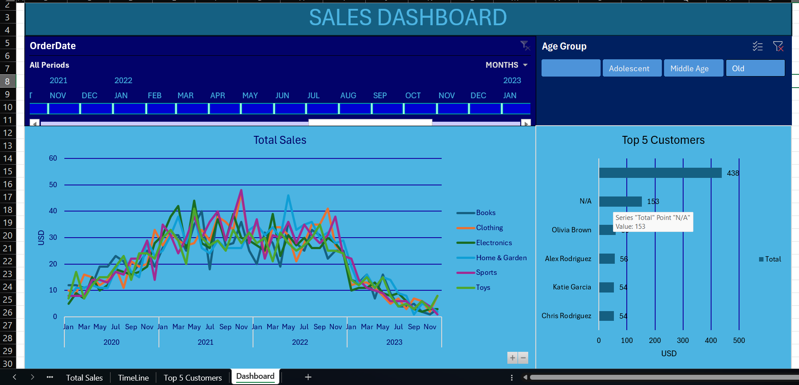

# E-Commerce Sales Analysis Dashboard

## Project Overview

This project presents a comprehensive analysis of an e-commerce dataset using Microsoft Excel. The goal was to transform raw transactional data into actionable business insights through data cleaning, exploratory data analysis, pivot tables, and dashboard visualizations.

The analysis focuses on sales performance, customer purchasing behavior, product trends, and order status distribution to support data-driven decision-making.

---

## Project Objectives

- Analyze overall sales performance.
- Identify top-performing products and categories.
- Evaluate customer purchasing behavior.
- Discover monthly and seasonal sales patterns.
- Build an interactive dashboard for business reporting.

---

## Dataset Information

The dataset contains e-commerce transaction records, including:

- Order ID
- Customer Information
- Product Category
- Product Name
- Quantity Purchased
- Unit Price
- Order Date
- Order Status

---

## Data Cleaning Process

Before analysis, the dataset underwent extensive cleaning to ensure data quality and reliability.

### Cleaning Tasks Performed

- Removed duplicate records.
- Standardized text formatting and naming conventions.
- Corrected inconsistent date formats.
- Handled missing and null values.
- Validated order statuses.
- Investigated pricing anomalies.
- Created calculated fields for sales and performance metrics.

---

## Key Performance Indicators (KPIs)

The dashboard tracks several important business metrics:

-  Total Orders
-  Total Quantity Sold
-  Average Order Value
-  Monthly Sales Trends
-  Order Status Distribution

---

## 🔍 Business Questions

This project aims to answer the following questions:

1. Which product categories generate the highest revenue?
2. What are the monthly sales trends?
3. Which products contribute most to overall sales?
4. What percentage of orders are completed, refunded, pending, or cancelled?
5. How does customer purchasing behavior vary across categories?
6. What factors influence overall revenue performance?

---

## Dashboard Features

The Excel dashboard includes:

- Interactive Pivot Tables
- Pivot Charts
- Monthly Sales Analysis
- Product Performance Analysis
- Dynamic Slicers and Filters

---

## Tools Used

- Microsoft Excel
- Pivot Tables
- Pivot Charts
- Slicers
- Conditional Formatting
- Data Validation
- Dashboard Design

---

## Key Insights

Some notable findings from the analysis include:

- Sales performance varies across different months.
- Certain product categories consistently outperform others.
- Data cleaning is critical for accurate business analysis.

---

## Dashboard Preview

### Dashboard Overview

---

## 🚀 Skills Demonstrated

- Data Cleaning
- Data Transformation
- Exploratory Data Analysis (EDA)
- Dashboard Development
- Data Visualization
- Problem Solving with Data

## 👨‍💻 Author

**Sfiso Tshabalala**

Aspiring Data Analyst passionate about transforming raw data into meaningful insights through analytics and visualization.

---

## ⭐ Acknowledgements

This project was created for portfolio development and to demonstrate practical data analytics skills using Microsoft Excel.
